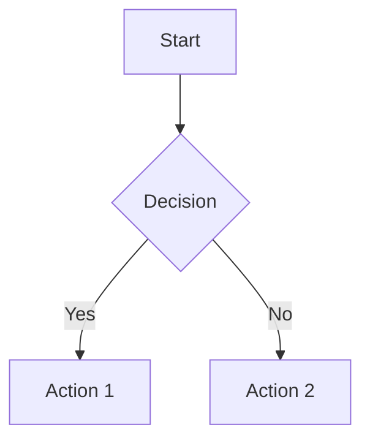

# Quick Start Guide

Get started with markpdf in minutes. This guide covers the essential commands and features you need to know.

## 📋 Table of Contents

- [Installation](#installation)
- [Basic Usage](#basic-usage)
- [Key Features](#key-features)
- [Common Commands](#common-commands)
- [Next Steps](#next-steps)

## Installation

### Install from npm

```bash
npm install -g @ml-lubich/markpdf
```

### Install as a dependency

```bash
npm install @ml-lubich/markpdf
```

### For development

```bash
git clone https://github.com/ml-lubich/markpdf.git
cd markpdf
npm install
npm run build
npm link
```

## Basic Usage

### Convert a Single File

```bash
markpdf document.md
```

This creates `document.pdf` in the same directory.

### Convert Multiple Files

```bash
markpdf *.md
markpdf chapter1.md chapter2.md chapter3.md
```

### Watch Mode (Auto-regenerate)

```bash
markpdf document.md --watch
```

Automatically regenerates the PDF when the file changes.

### Convert from Stdin

```bash
cat document.md | markpdf > output.pdf
echo "# Hello" | markpdf > output.pdf
```

## Key Features

### Mermaid Diagram Support

Simply include Mermaid code blocks in your Markdown:

````markdown

````

The tool automatically:
- Detects Mermaid code blocks
- Renders them to images
- Embeds them in the PDF
- Cleans up temporary files

**Supported diagram types:**
- Flowcharts
- Sequence Diagrams
- Gantt Charts
- Class Diagrams
- State Diagrams
- Entity Relationship Diagrams
- And more!

### Syntax Highlighting

Automatic syntax highlighting for code blocks:

```bash
markpdf document.md --highlight-style monokai
```

Available themes: `github`, `monokai`, `vs`, `atom-one-dark`, `dracula`, etc.

### Custom Styling

Add custom CSS:

```bash
markpdf document.md --stylesheet custom.css --css "body { font-size: 12pt; }"
```

## Common Commands

### Get Help

```bash
markpdf --help
```

### Show Version

```bash
markpdf --version
```

### Custom PDF Format

```bash
markpdf document.md --pdf-options '{"format": "Letter", "margin": "20mm"}'
```

### Generate HTML Instead of PDF

```bash
markpdf document.md --as-html
```

### Front Matter Configuration

Configure PDF options directly in your Markdown file:

````markdown
---
pdf_options:
  format: a4
  margin: 30mm
  printBackground: true
stylesheet:
  - custom.css
highlight_style: monokai
---

# Your Document
````

## Next Steps

- **Detailed Usage**: See [USAGE.md](./USAGE.md) for comprehensive documentation
- **CLI Reference**: See [../CLI-INTERFACE.md](../CLI-INTERFACE.md) for all options
- **Examples**: Check [../../examples/](../../examples/) directory
- **Architecture**: See [../ARCHITECTURE.md](../ARCHITECTURE.md) for developers

## Troubleshooting

### Command Not Found

If `markpdf` is not found:
- Ensure it's installed: `npm install -g @ml-lubich/markpdf`
- Or use: `npx @ml-lubich/markpdf` instead
- For development: run `npm link` after building

### Permission Denied

Make sure the CLI file is executable:
```bash
chmod +x dist/cli.js
npm link
```

### Port Already in Use

Specify a different port:
```bash
markpdf document.md --port 3001
```

### Mermaid Charts Not Rendering

- Ensure internet connection (Mermaid.js is loaded from CDN)
- Check that Mermaid code blocks use exactly `\`\`\`mermaid` (lowercase)
- Wait a bit longer - first render can take time
