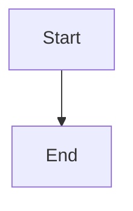

# How to Run markpdf

This guide explains different ways to run the `markpdf` tool to convert Markdown files to PDF.

## Quick Start

### Option 1: Run Directly with Node (Recommended for Development)

Since the project is already built, you can run it directly using Node:

```bash
# Convert a single file
node dist/cli.js src/test/mermaid/test-mermaid.md

# Convert with watch mode
node dist/cli.js src/test/mermaid/test-mermaid.md -w

# Get help
node dist/cli.js --help
```

### Option 2: Use npm link (For Development)

Link the package globally so you can use the `markpdf` command from anywhere:

```bash
# From the project root directory
npm link

# Now you can use markpdf from anywhere
markpdf src/test/mermaid/test-mermaid.md
markpdf --help
```

### Option 3: Use npx (Without Installing)

Run directly using npx:

```bash
# Make sure you're in the project directory
npx markpdf src/test/mermaid/test-mermaid.md
```

### Option 4: Install Globally

Install the package globally:

```bash
# Build first (if not already built)
npm run build

# Install globally
npm install -g .

# Now use markpdf from anywhere
markpdf src/test/mermaid/test-mermaid.md
```

## Common Usage Examples

### Convert a Single File

```bash
node dist/cli.js src/test/mermaid/test-mermaid.md
```

This will create `src/test/mermaid/test-mermaid.pdf` in the same directory.

### Convert Multiple Files

```bash
# Convert all markdown files in a directory
node dist/cli.js src/test/**/*.md

# Convert specific files
node dist/cli.js file1.md file2.md file3.md
```

### Watch Mode (Auto-regenerate on Changes)

```bash
node dist/cli.js src/test/mermaid/test-mermaid.md -w
```

The tool will watch the file for changes and automatically regenerate the PDF when you save.

### Custom Styling

```bash
# Use a custom stylesheet
node dist/cli.js file.md --stylesheet custom.css

# Use inline CSS
node dist/cli.js file.md --css "body { font-family: Arial; }"

# Change code highlighting theme
node dist/cli.js file.md --highlight-style monokai
```

### Custom PDF Options

```bash
# Custom page format and margins
node dist/cli.js file.md --pdf-options '{"format": "Letter", "margin": "20mm"}'

# Print media type (for better print styling)
node dist/cli.js file.md --page-media-type print
```

### Output HTML Instead of PDF

```bash
# Generate HTML file instead of PDF
node dist/cli.js file.md --as-html
```

### Use a Config File

Create a `config.json` file:

```json
{
  "highlight_style": "monokai",
  "pdf_options": {
    "format": "A4",
    "margin": "20mm"
  }
}
```

Then use it:

```bash
node dist/cli.js file.md --config-file config.json
```

## Working with Mermaid Charts

The tool automatically processes Mermaid charts in markdown files. Just include mermaid code blocks:

````markdown

````

The tool will:
1. Render each mermaid chart to a PNG image
2. Replace the mermaid code block with an image reference
3. Include the image in the final PDF

## Testing the Mermaid Example

To test the mermaid charts file we created:

```bash
# Convert the mermaid test file
node dist/cli.js src/test/mermaid/test-mermaid.md

# This will create: src/test/mermaid/test-mermaid.pdf
```

## Troubleshooting

### Command Not Found

If you get "command not found", use Option 1 (run with node directly) or run `npm link` first.

### Build Errors

If you encounter issues, rebuild the project:

```bash
npm run build
```

### Watch Mode Not Working

Make sure you're using the `-w` or `--watch` flag:

```bash
node dist/cli.js file.md -w
```

### Port Already in Use

If you get a port error, specify a different port:

```bash
node dist/cli.js file.md --port 3001
```

## Development Mode

For development, you can run the TypeScript compiler in watch mode:

```bash
# Terminal 1: Watch for TypeScript changes
npm start

# Terminal 2: Run the tool (rebuilds automatically)
node dist/cli.js src/test/mermaid/test-mermaid.md
```

## More Information

For detailed options and advanced usage, run:

```bash
node dist/cli.js --help
```

Or check the main README.md file.

