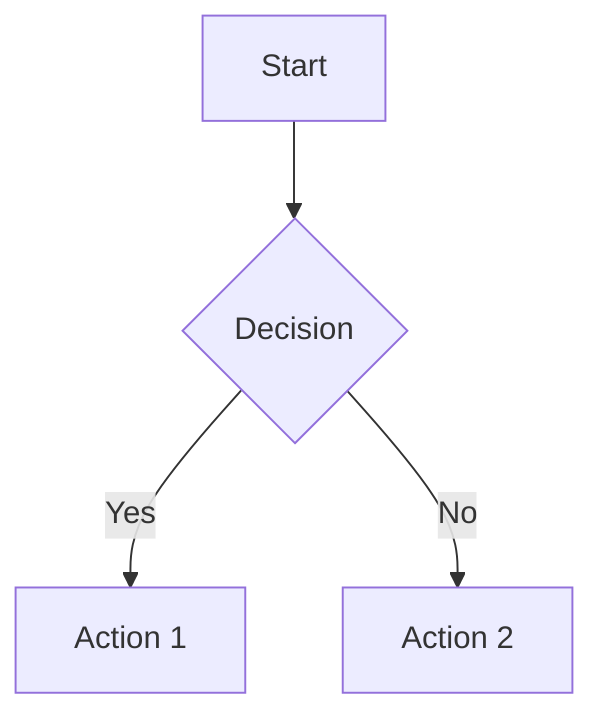

# Usage Guide

Comprehensive guide to using markpdf for converting Markdown files to PDF and HTML.

## 📋 Table of Contents

- [Installation Options](#installation-options)
- [Command-Line Usage](#command-line-usage)
  - [Basic Commands](#basic-commands)
  - [Input Options](#input-options)
  - [Output Options](#output-options)
- [Configuration](#configuration)
  - [Configuration Sources](#configuration-sources)
  - [CLI Options](#cli-options)
  - [Front Matter](#front-matter)
  - [Config Files](#config-files)
- [Features](#features)
  - [Mermaid Diagrams](#mermaid-diagrams)
  - [Syntax Highlighting](#syntax-highlighting)
  - [Custom Styling](#custom-styling)
  - [Watch Mode](#watch-mode)
- [Examples](#examples)
- [Troubleshooting](#troubleshooting)

## Installation Options

### Global Installation

```bash
npm install -g @ml-lubich/markpdf
```

After installation, use `markpdf` from anywhere:

```bash
markpdf document.md
```

### Local Installation (as Dependency)

```bash
npm install @ml-lubich/markpdf
```

Then use in your code:

```typescript
import { mdToPdf } from '@ml-lubich/markpdf';

const pdf = await mdToPdf({ path: 'document.md' });
```

### Development Installation

```bash
git clone https://github.com/ml-lubich/markpdf.git
cd markpdf
npm install
npm run build
npm link
```

## Command-Line Usage

### Basic Commands

```bash
# Convert single file
markpdf document.md

# Convert multiple files
markpdf *.md
markpdf file1.md file2.md file3.md

# Watch mode
markpdf document.md --watch

# Show help
markpdf --help

# Show version
markpdf --version
```

### Input Options

#### File Input

```bash
markpdf path/to/document.md
```

#### Stdin Input

```bash
cat document.md | markpdf > output.pdf
echo "# Hello World" | markpdf > output.pdf
```

### Output Options

#### Default Output

Creates PDF file with same name as input:

```bash
markpdf document.md  # Creates document.pdf
```

#### HTML Output

```bash
markpdf document.md --as-html  # Creates document.html
```

#### Custom Output Path

Use `--dest` option (handled internally via configuration).

## Configuration

### Configuration Sources

Configuration is merged in this order (later sources override earlier ones):

1. **Default configuration** - Built-in defaults
2. **Config file** (optional) - JSON/JS file specified with `--config-file`
3. **Front matter** (optional) - YAML front matter in the Markdown file
4. **CLI arguments** - Command-line options (highest priority)

### CLI Options

#### General Options

| Option | Description | Example |
|--------|-------------|---------|
| `-h, --help` | Show help | `markpdf --help` |
| `-v, --version` | Show version | `markpdf --version` |
| `-w, --watch` | Watch mode | `markpdf doc.md --watch` |

#### Styling Options

| Option | Description | Example |
|--------|-------------|---------|
| `--stylesheet <path>` | Custom stylesheet | `--stylesheet custom.css` |
| `--css <css>` | Inline CSS | `--css "body { font-size: 12pt; }"` |
| `--highlight-style <name>` | Code highlighting theme | `--highlight-style monokai` |
| `--body-class <class>` | Body CSS class | `--body-class markdown-body` |

#### PDF Options

| Option | Description | Example |
|--------|-------------|---------|
| `--pdf-options <json>` | Puppeteer PDF options | `--pdf-options '{"format":"Letter"}'` |
| `--page-media-type <type>` | Media type (screen/print) | `--page-media-type print` |

#### Advanced Options

| Option | Description | Example |
|--------|-------------|---------|
| `--config-file <path>` | Config file | `--config-file config.json` |
| `--basedir <path>` | Base directory | `--basedir ./docs` |
| `--port <number>` | HTTP server port | `--port 3000` |
| `--as-html` | Output HTML | `--as-html` |
| `--devtools` | Open browser devtools | `--devtools` |

### Front Matter

Configure PDF options in your Markdown file:

````markdown
---
pdf_options:
  format: a4
  margin: 30mm 25mm
  printBackground: true
  headerTemplate: |-
    <div style="text-align: center; font-size: 11px;">
      Document Title
    </div>
  footerTemplate: |-
    <div style="text-align: center;">
      Page <span class="pageNumber"></span> of <span class="totalPages"></span>
    </div>
stylesheet:
  - https://cdnjs.cloudflare.com/ajax/libs/github-markdown-css/5.0.0/github-markdown.min.css
body_class: markdown-body
highlight_style: github
---

# Your Document Content
````

### Config Files

Create a JSON config file:

```json
{
  "highlight_style": "monokai",
  "pdf_options": {
    "format": "A4",
    "margin": "20mm"
  },
  "stylesheet": ["custom.css"]
}
```

Or JavaScript config file:

```javascript
module.exports = {
  highlight_style: 'monokai',
  pdf_options: {
    format: 'A4',
    margin: '20mm'
  },
  stylesheet: ['custom.css']
};
```

Use it:

```bash
markpdf document.md --config-file config.json
```

## Features

### Mermaid Diagrams

**How it works:**
1. Tool detects `\`\`\`mermaid` code blocks
2. Each diagram is rendered to a PNG image
3. Images are embedded as base64 data URIs in the PDF
4. Temporary files are automatically cleaned up

**Example:**

````markdown

````

**Important:**
- Use exactly `\`\`\`mermaid` (lowercase) - case-sensitive
- No Mermaid charts = faster processing (nothing generated)
- Multiple charts are processed sequentially

### Syntax Highlighting

Automatic syntax highlighting for code blocks using highlight.js:

```bash
markpdf document.md --highlight-style github
```

Popular themes: `github`, `monokai`, `vs`, `atom-one-dark`, `dracula`, `github-dark`.

### Custom Styling

#### Stylesheet Files

```bash
markpdf document.md --stylesheet custom.css --stylesheet theme.css
```

#### Inline CSS

```bash
markpdf document.md --css "body { font-family: 'Georgia', serif; font-size: 12pt; }"
```

#### Remote Stylesheets

```bash
markpdf document.md --stylesheet https://cdn.example.com/style.css
```

### Watch Mode

Automatically regenerate PDF when files change:

```bash
markpdf document.md --watch
```

Press `Ctrl+C` to stop watching.

## Examples

### Basic Conversion

```bash
markpdf README.md
```

### Custom Styling

```bash
markpdf document.md \
  --stylesheet custom.css \
  --css "body { font-family: 'Georgia', serif; }" \
  --highlight-style monokai
```

### Custom PDF Format

```bash
markpdf document.md --pdf-options '{"format": "Letter", "landscape": true, "margin": "1in"}'
```

### Watch Mode

```bash
markpdf document.md --watch
```

### Multiple Files with Config

```bash
markpdf chapter*.md --config-file book-config.json
```

### Stdin to Stdout

```bash
cat document.md | markpdf > output.pdf
```

### Generate HTML

```bash
markpdf document.md --as-html
```

## Troubleshooting

### Command Not Found

**Issue:** `zsh: command not found: markpdf`

**Solutions:**
1. Install globally: `npm install -g @ml-lubich/markpdf`
2. Use npx: `npx @ml-lubich/markpdf document.md`
3. For development: `npm link` after building

### Permission Denied

**Issue:** `zsh: permission denied: markpdf`

**Solutions:**
```bash
# Make CLI executable
chmod +x dist/cli.js

# Re-link
npm unlink
npm link
```

### Port Already in Use

**Issue:** Error about port being in use

**Solution:**
```bash
markpdf document.md --port 3001
```

### Mermaid Charts Not Showing

**Issue:** Mermaid diagrams appear as links or not rendered

**Check:**
- Use exactly `\`\`\`mermaid` (lowercase) - case-sensitive
- Ensure internet connection (Mermaid.js loaded from CDN)
- Wait longer - first render can take time
- Check browser console if using `--devtools`

### Process Hangs

**Issue:** Command doesn't complete

**Causes:**
- Mermaid processing (can take time with many charts)
- Browser launching (first run is slower)
- Network issues downloading Mermaid.js

**Solutions:**
- Wait longer (first run can be slow)
- Check internet connection
- Try with simpler file first: `markpdf src/test/basic/test.md`

### File Not Found

**Issue:** Error about file not found

**Solution:**
```bash
# Use absolute path
markpdf /full/path/to/document.md

# Or relative path
markpdf ./document.md
```

## Related Documentation

- **Quick Start**: [QUICKSTART.md](./QUICKSTART.md) - Get started quickly
- **CLI Reference**: [../cli-interface.md](../cli-interface.md) - Complete CLI reference
- **Examples**: [../../examples/](../../examples/) - Example files
- **Architecture**: [../architecture.md](../architecture.md) - System architecture
