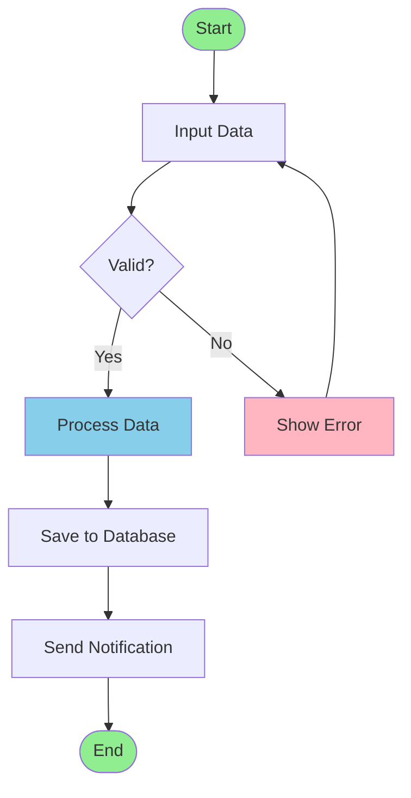
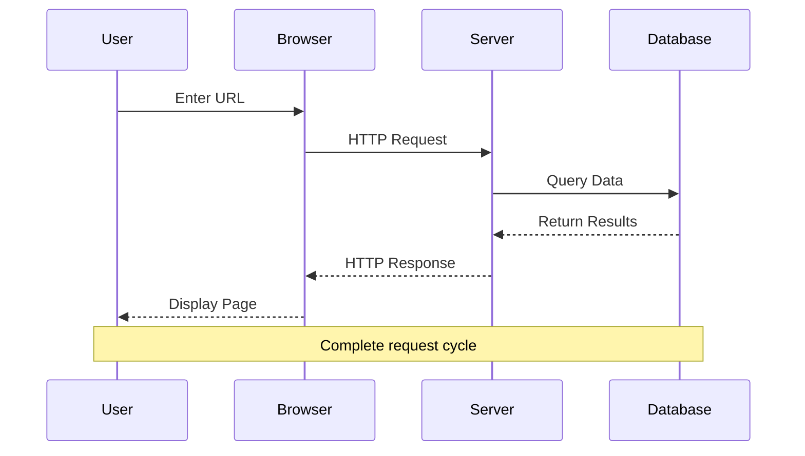
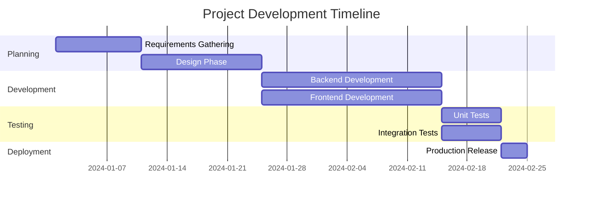
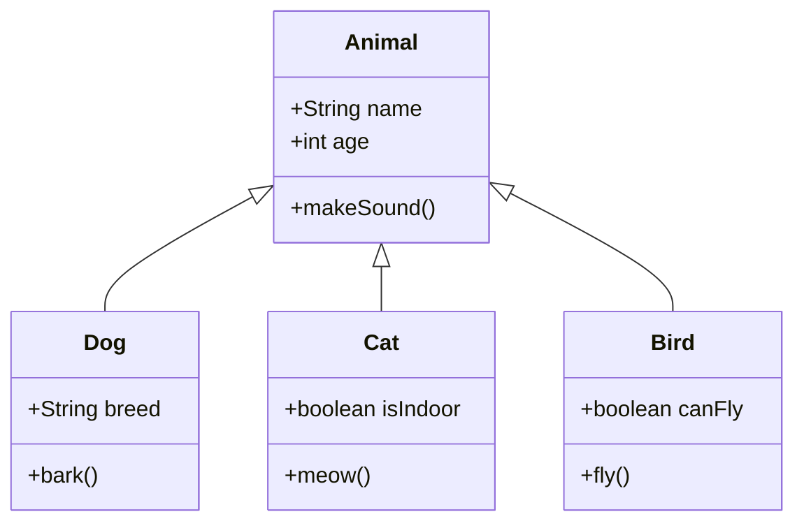
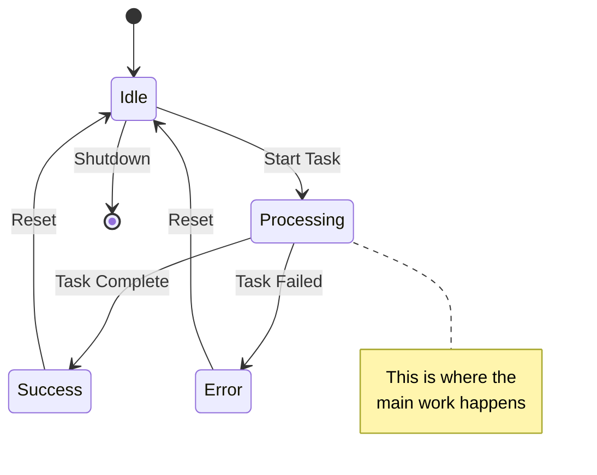
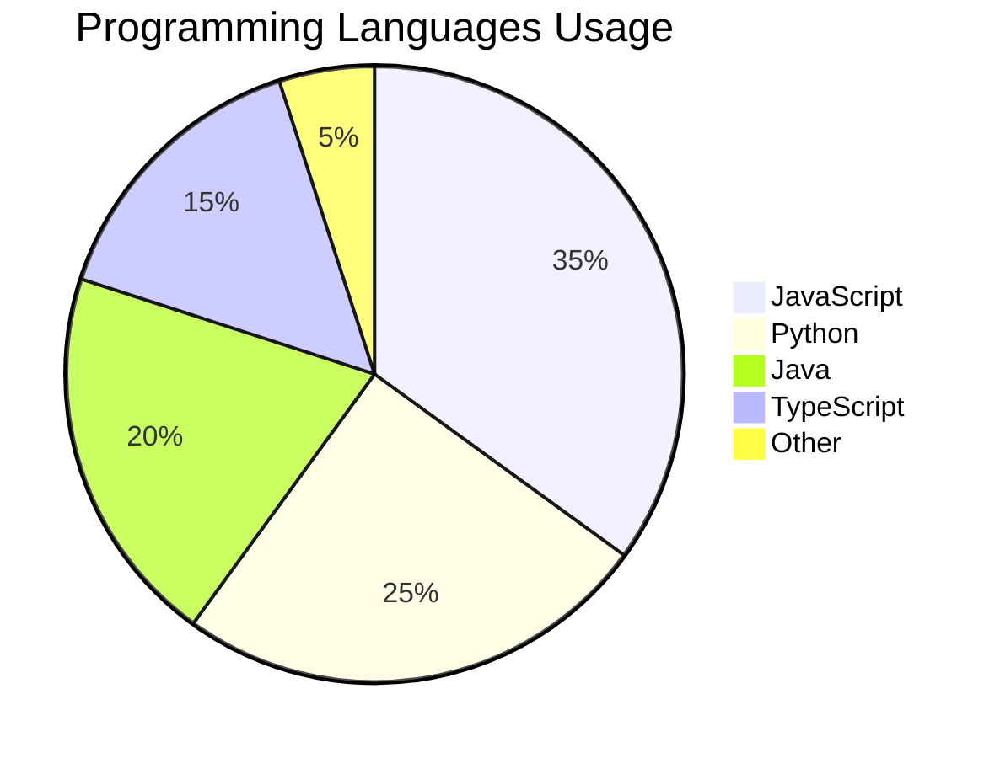
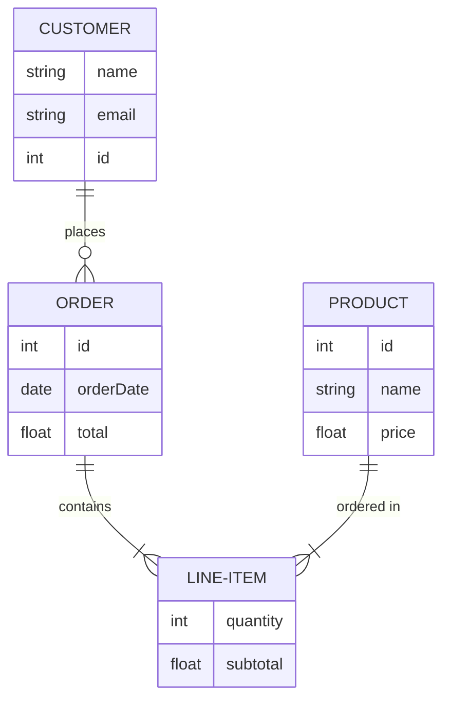
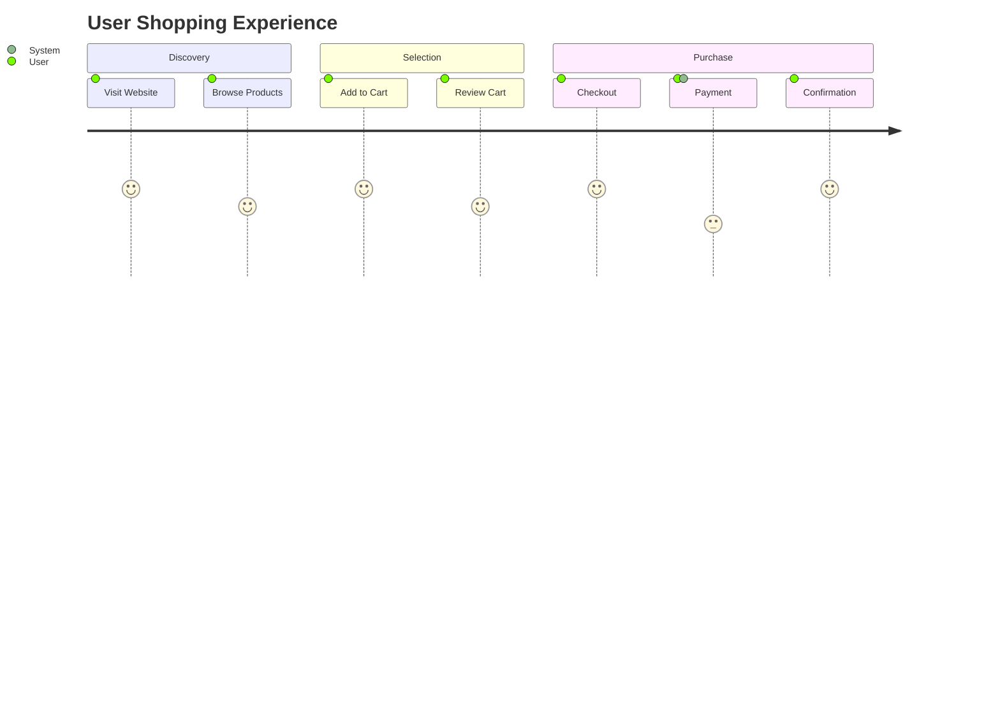
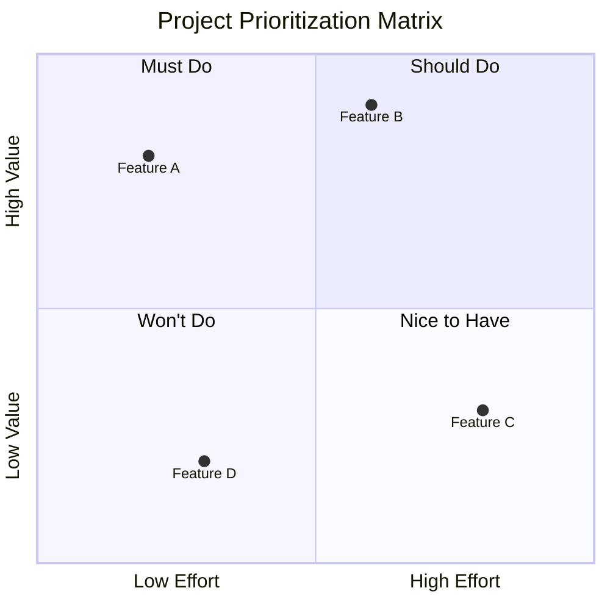
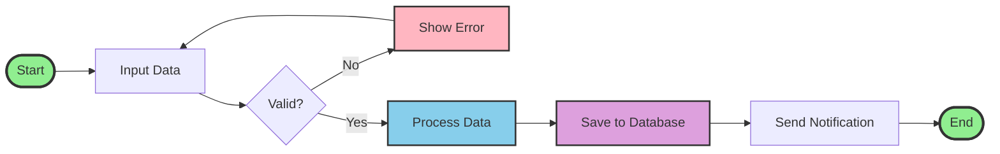

---
pdf_options:
  format: a4
  margin: 30mm 25mm
  printBackground: true
  displayHeaderFooter: false
stylesheet:
  - https://cdnjs.cloudflare.com/ajax/libs/github-markdown-css/5.0.0/github-markdown.min.css
body_class: markdown-body
highlight_style: github
---

# 🎨 Mermaid Diagrams Demo

This document showcases the beautiful Mermaid diagrams that can be rendered in PDF format using markpdf.

## 📊 Flowchart

A decision-making flowchart:



## 🔄 Sequence Diagram

Interaction between system components:



## 📅 Gantt Chart

Project timeline visualization:



## 🏗️ Class Diagram

Object-oriented relationships:



## 🔀 State Diagram

State machine visualization:



## 📈 Pie Chart

Data distribution:



## 🌳 Git Graph

Version control visualization:

```mermaid
gitgraph
    commit id: "Initial"
    commit id: "Feature A"
    branch develop
    checkout develop
    commit id: "Dev Work 1"
    commit id: "Dev Work 2"
    checkout main
    commit id: "Hotfix"
    checkout develop
    commit id: "Dev Work 3"
    checkout main
    merge develop
    commit id: "Release"
```

## 🗄️ Entity Relationship Diagram

Database schema:



## 🎯 User Journey

Customer experience flow:



## 📊 Quadrant Chart

Project prioritization:



## 🎨 Complex Flowchart

Multi-path decision tree:



## 📝 Conclusion

This document demonstrates the power of Mermaid diagrams in markdown documents. All diagrams are automatically rendered as high-quality images in the PDF output, making your documentation both beautiful and informative.

---

*Generated with markpdf - A modern Markdown to PDF converter*

