---
pdf_options:
  format: a4
  margin: 30mm 25mm
  displayHeaderFooter: false
---

# Mermaid Charts Examples

This document demonstrates various types of Mermaid charts that can be rendered in markdown.

## 1. Flowchart

A simple flowchart showing a decision process:

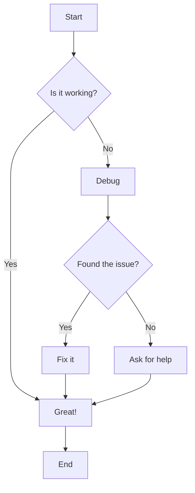

## 2. Sequence Diagram

A sequence diagram showing interaction between components:

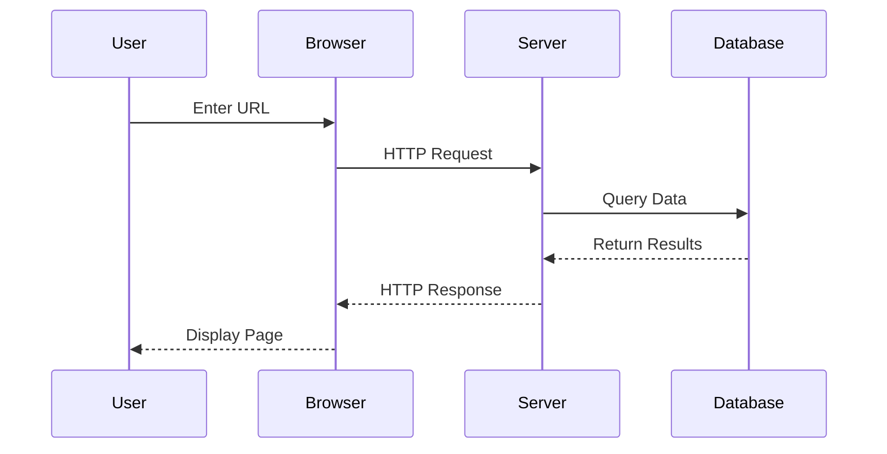

## 3. Gantt Chart

A project timeline using a Gantt chart:

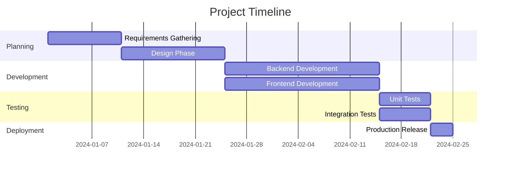

## 4. Class Diagram

A class diagram showing object-oriented relationships:

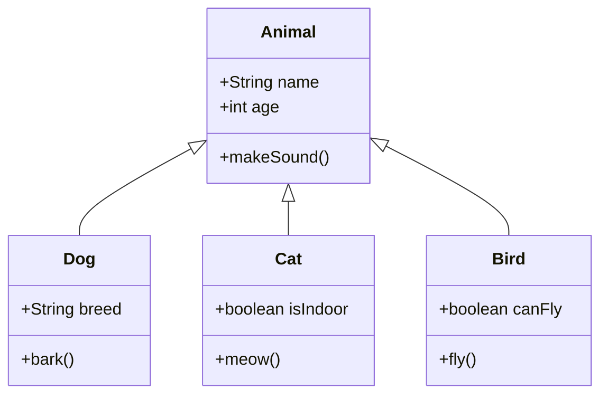

## 5. State Diagram

A state diagram showing a simple state machine:

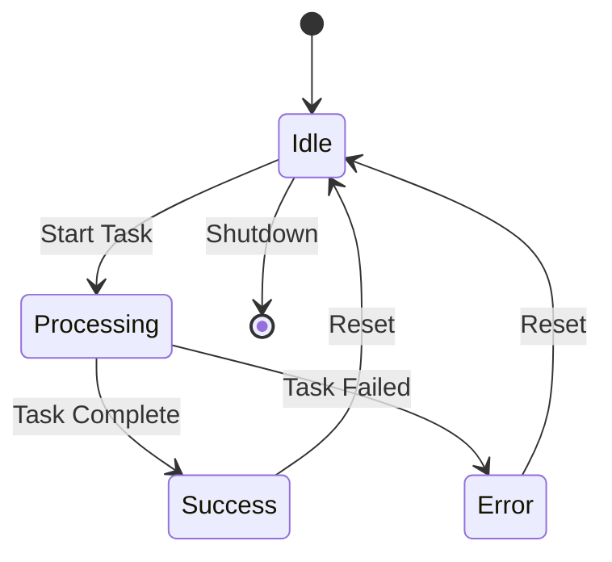

## 6. Pie Chart

A pie chart showing data distribution:

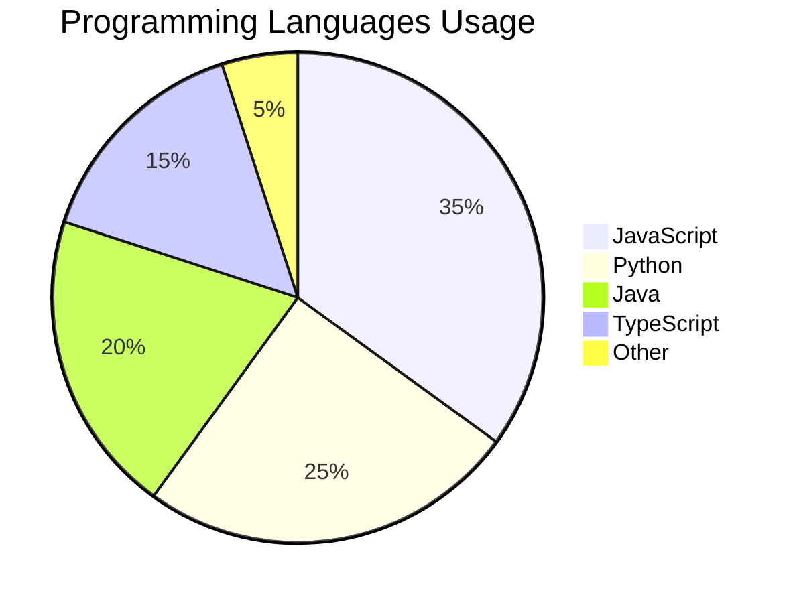

## 7. Git Graph

A Git graph showing branch structure:

```mermaid
gitgraph
    commit id: "Initial"
    commit id: "Feature A"
    branch develop
    checkout develop
    commit id: "Dev Work 1"
    commit id: "Dev Work 2"
    checkout main
    commit id: "Hotfix"
    checkout develop
    commit id: "Dev Work 3"
    checkout main
    merge develop
    commit id: "Release"
```

## 8. Entity Relationship Diagram

An ER diagram showing database relationships:

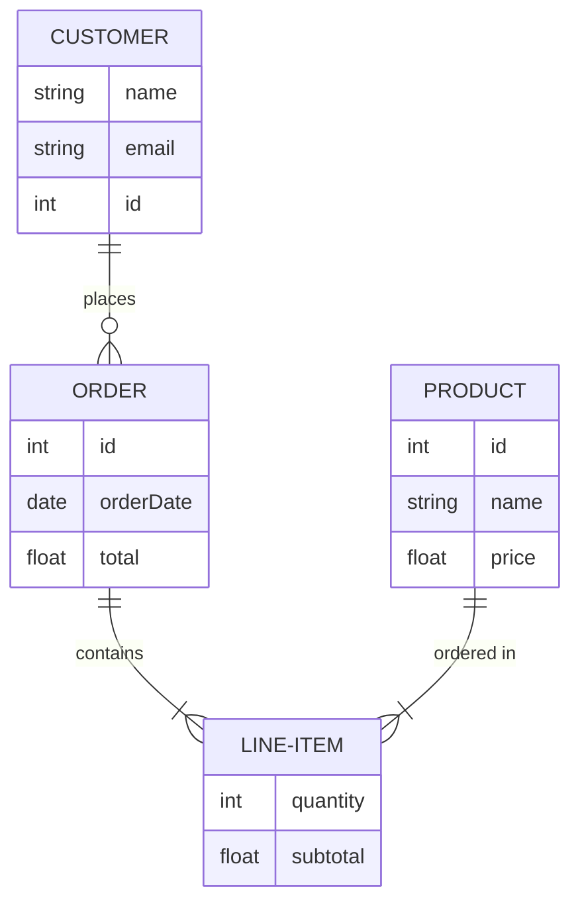

## 9. User Journey

A user journey diagram:

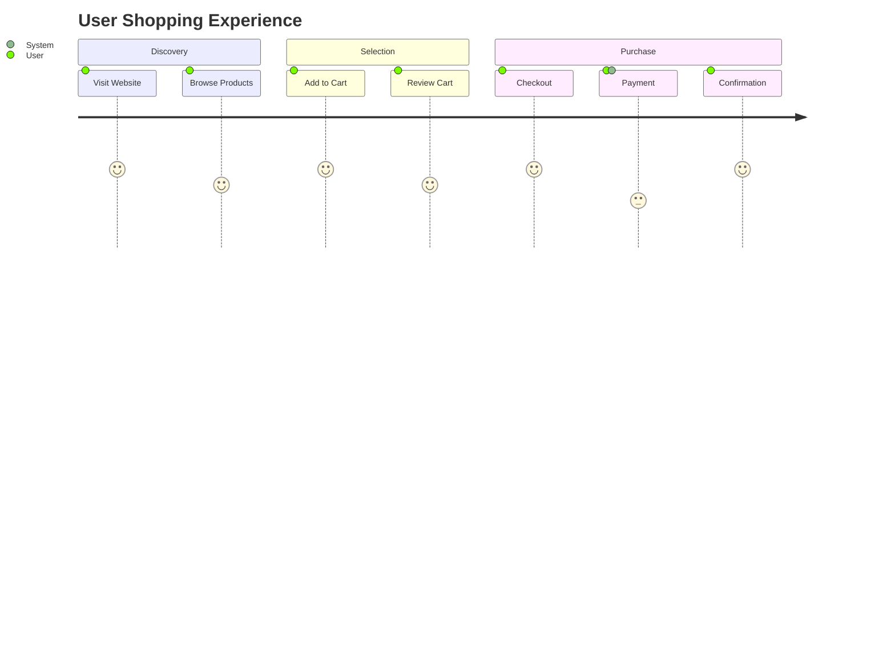

## 10. Complex Flowchart

A more complex flowchart with multiple paths:

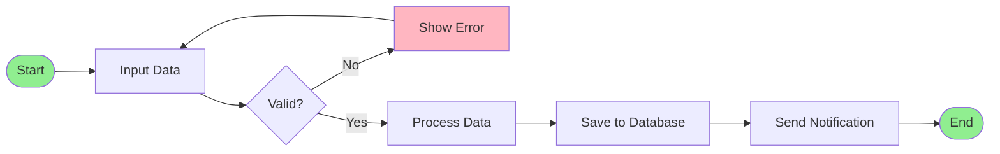

## 11. Quadrant Chart

A quadrant chart for prioritization:

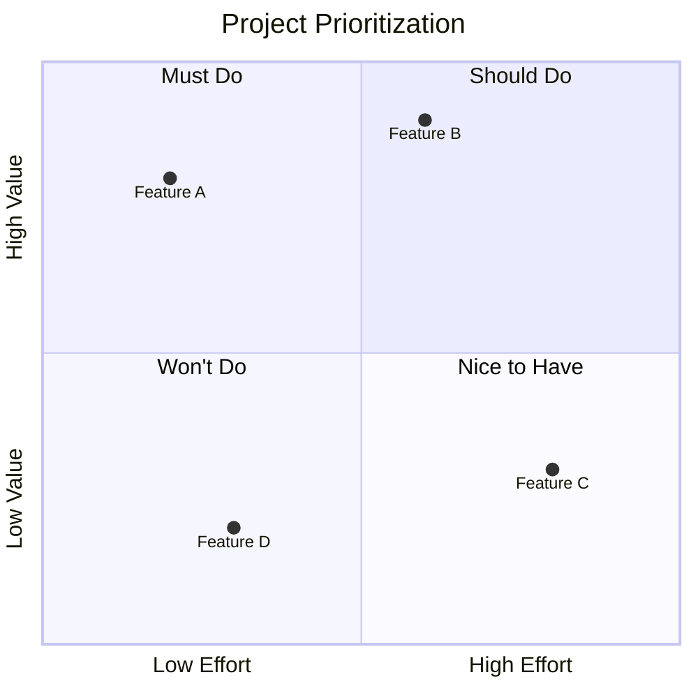

## 12. Requirement Diagram

A requirement diagram showing system requirements:

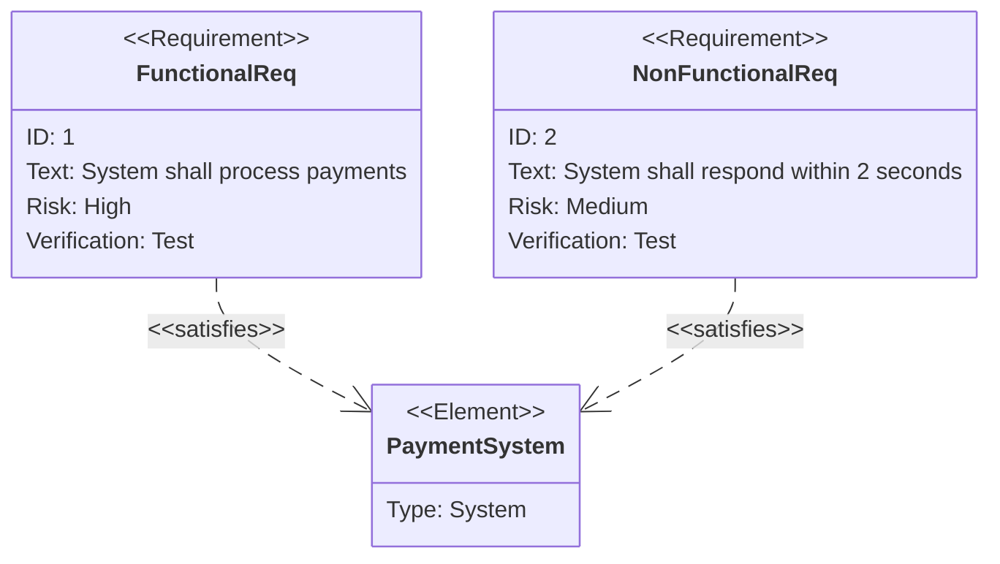

## Conclusion

These examples demonstrate the variety of diagrams that can be created using Mermaid syntax in markdown files. Each chart type serves different purposes and can help visualize complex information in a clear and structured way.

